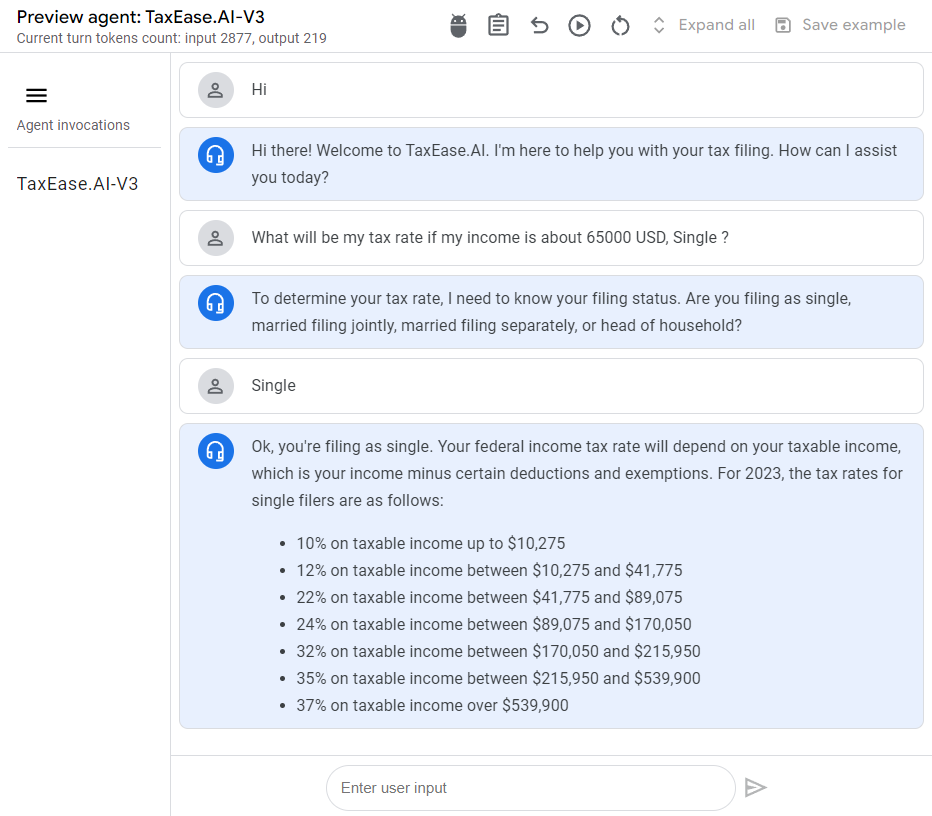
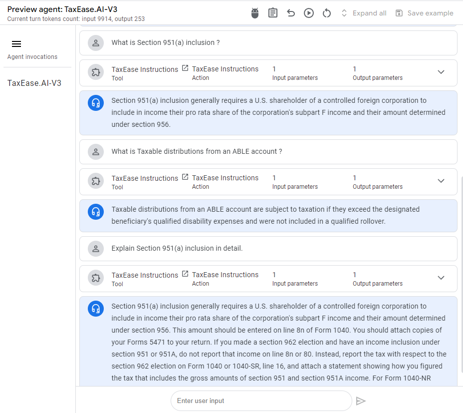
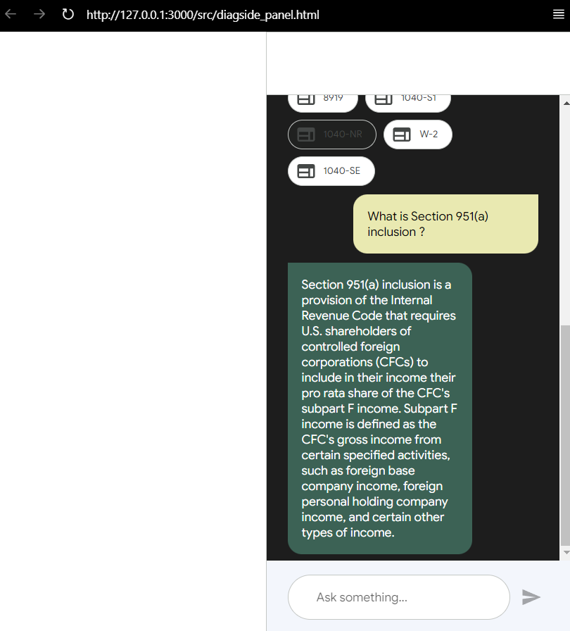
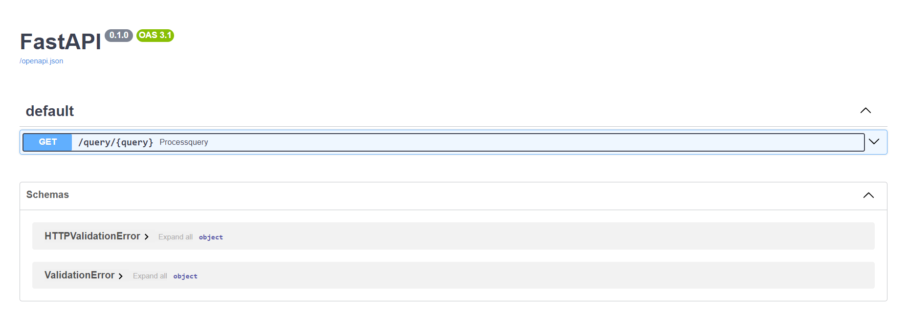
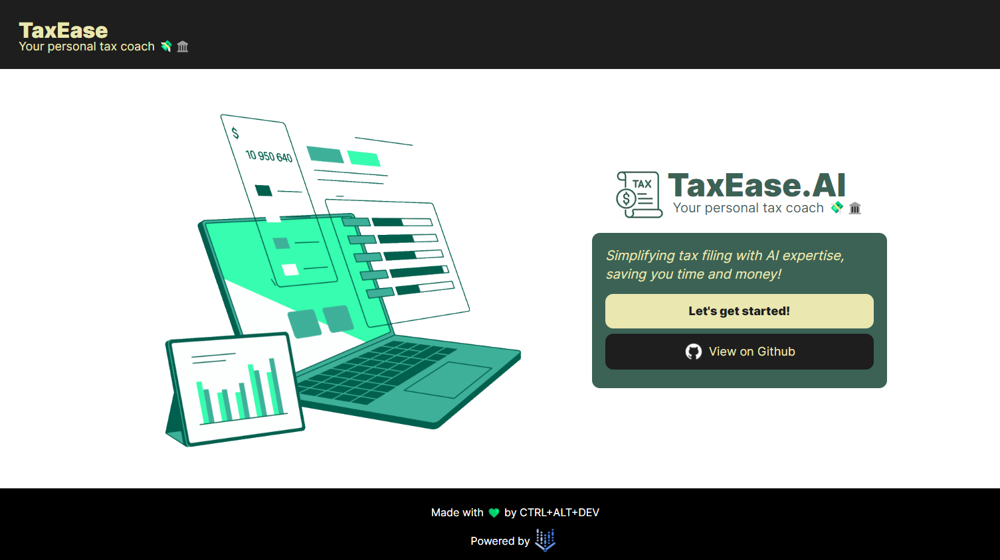
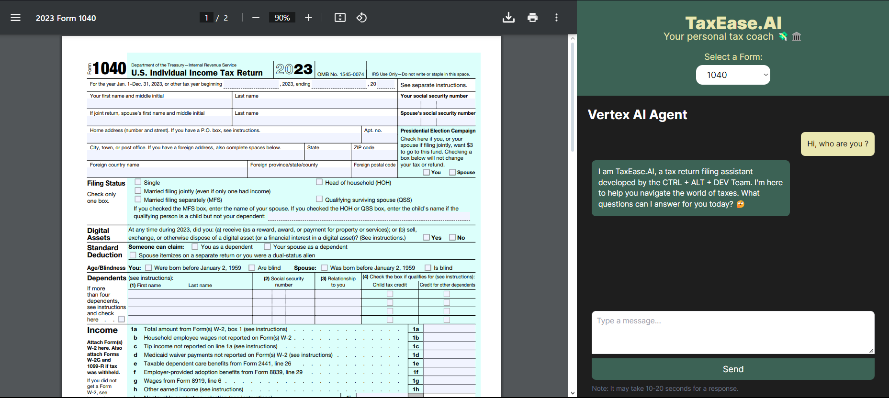
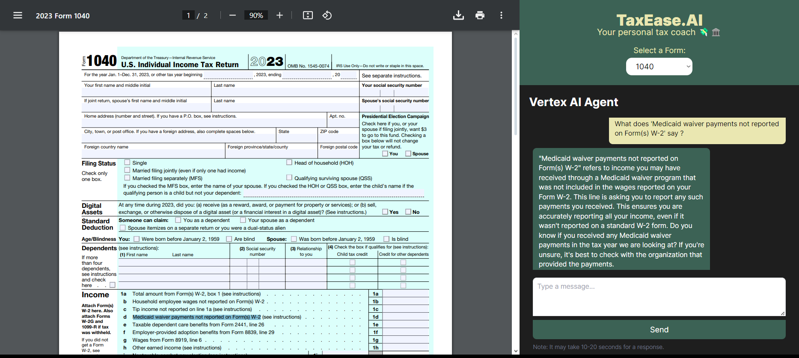
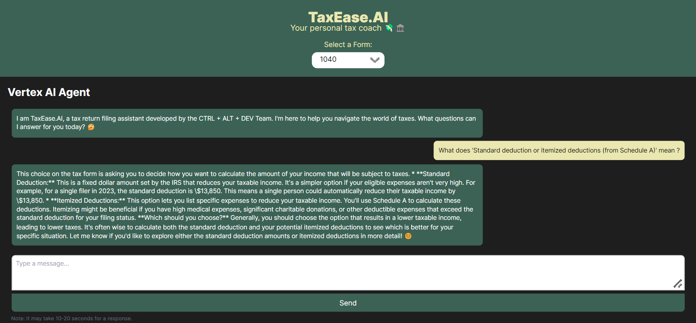
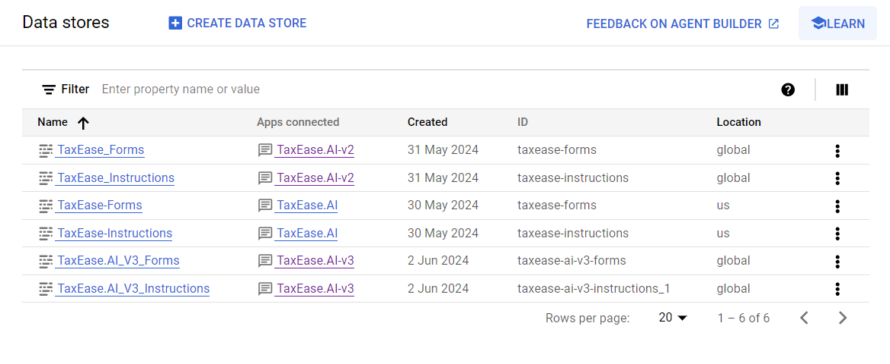

# **TaxEase.AI : Vertex AI Agent 🤖**


## **Description 📃**

**TaxEase.AI** is a user-friendly AI assistant designed to demystify and simplify US tax filing, a system that has become needlessly convoluted and stressful for millions of Americans. 

Built on the powerful Vertex AI platform, TaxEase.AI utilizes a comprehensive knowledge base within Datastore, containing up-to-date tax forms, instructions, FAQs, and more. Seamless communication via OpenAPI and a sophisticated Retrieval Augmented Generation (RAG) approach ensure that TaxEase.AI provides accurate, personalized, and easy-to-understand guidance throughout the entire tax filing process. 

## **Contributors 🦖**
<table style="width:100%; text-align:center;border: none;">
    <tr>
        <td style="width:33.33%;"></td>
        <td style="width:33.33%;"></td>
        <td style="width:33.33%;"></td>
    </tr>
    <tr>
        <td><a href="https://github.com/VishalTheHuman" style="display:block; margin:auto;">@VishalTheHuman</a></td>
        <td><a href="https://github.com/amri-tah" style="display:block; margin:auto;">@amri-tah</a></td>
        <td><a href="https://github.com/SaranDharshanSP" style="display:block; margin:auto;">@SaranDharshanSP</a></td>
    </tr>
    <tr>
        <td><b style="display:block; margin:auto;">Vishal S</b></td>
        <td><b style="display:block; margin:auto;">Amritha Nandini</b></td>
        <td><b style="display:block; margin:auto;">Saran Dharshan S P</b></td>
    </tr>
</table>

## **Inspiration ✨**

Our inspiration for **TaxEase.AI** stemmed from a deep empathy for the millions of Americans who dread the annual ritual of tax filing.  Emmy-winning journalist Johnny Harris eloquently captured this sentiment in his video essay, 
 "[*Why Americans Pay to Do Their Taxes ?* ](https://www.youtube.com/watch?v=ZhV4Z76mXrI)". Harris exposed the absurdity of a system that forces its citizens to navigate a labyrinth of complex forms and expensive software, all while simpler, government-run solutions exist in numerous other countries. 

We've all felt the frustration – the hours wasted deciphering cryptic forms, the fear of missing a crucial deduction, the sinking feeling when you realize you need to shell out for expensive tax software. It's a system seemingly designed to confuse and intimidate, turning a simple civic duty into a stressful, time-consuming ordeal. What's even more infuriating is that it doesn't have to be this way.  As Harris pointed out, this stark contrast highlights the absurdity of the American system, where powerful corporations profit from a process that should be a simple service for all citizens. We were tired of seeing hardworking Americans taken advantage of, their time and money siphoned away by a system rigged against them. We knew there had to be a better way. 

## **What it does  💡**

TaxEase.AI is a user-friendly AI assistant designed to demystify and simplify US tax filing.  Here's how it works:

* **Direct Form Filling:** Already know the forms you need? TaxEase.AI acts as your smart assistant, guiding you through the process and answering your questions in real-time. 
* **Interactive Guidance:**  Not sure where to start? TaxEase.AI  engages in a friendly Q&A to understand your unique situation. It then recommends relevant forms, identifies potential deductions, and helps you avoid costly errors. 

## **How we built it  🛠️**

* **Vertex AI:**  Our entire application is built on the powerful Vertex AI platform, using its agent as the brain of our system to understand requests and manage interactions.
* **Datastore:** We've created a comprehensive knowledge base within Datastore, storing all the latest tax forms, instructions, FAQs, and more. This ensures TaxEase.AI always has the most up-to-date information.
* **OpenAPI:** Seamless communication is key! We integrated OpenAPI to allow our AI agent to smoothly retrieve and process data from Datastore.
* **RAG Approach:** We implemented a Retrieval Augmented Generation (RAG) approach. This means TaxEase.AI doesn't just spit out generic answers; it retrieves relevant information and crafts personalized responses just for you. 

## **Challenges we ran into  🚧**

* **Accuracy & Compliance:**  Taxes are serious business! We worked hard to build in robust validation checks and ensure our system adheres to IRS guidelines.
* **Tax Code Complexity:** Let's face it, the US tax code is a beast.  Building an AI system capable of understanding and navigating its intricacies was no easy feat!
* **User-Friendliness:**  Taxes are confusing enough without a clunky interface.  We prioritized designing a clean, intuitive, and approachable user experience for everyone. 

## **Accomplishments that we're proud of 🎉**

* **Functional AI Tax Assistant:** We built a working prototype that showcases the power of AI to simplify taxes.
* **User-Centric Design:**  TaxEase.AI is designed with you in mind, focusing on making the experience as smooth and painless as possible.
* **Equity in Action:** We believe TaxEase.AI has the potential to make tax filing less intimidating and more accessible for all, regardless of income or technical expertise. 

## **What we learned  📚**

* **The Power of Vertex AI:** This project gave us invaluable experience with Vertex AI's incredible capabilities, solidifying our understanding of intelligent agent development.
* **User-First, Always:** When dealing with complex topics like taxes, simple and clear design is paramount. 
* **AI for Good:**  This project reinforced our belief in the power of AI to create positive change and address real-world problems.

## **What's next for TaxEase.AI 🚀**

* **Expand Functionality:**  We envision integrating with financial platforms, enabling automatic form population from user data, and offering advanced features for more complex tax scenarios.
* **Testing & Refinement:** We'll be conducting thorough testing with real users to gather feedback and make TaxEase.AI even more accurate and user-friendly.
* **Advocacy for Change:**  We plan to use TaxEase.AI to raise awareness about the need for a simpler, fairer, and more transparent US tax system.  

## **Test Script 🖊️**
```
What will be my tax rate if my income is about 65000 USD, Single ?
```
```
What is Section 951(a) inclusion ?
```
```
What are 'Standard deduction or itemized deductions' from Schedule A ? 
```

## **Screenshots 💻**

### **Agent Preview**



### **Diagflow CX Side Panel**



### **Website Deployment**




#### **Zoomed Out**


## **Setup ⚙️**

### Diagflow CX Side Panel

```html
<link rel="stylesheet" href="https://www.gstatic.com/dialogflow-console/fast/df-messenger/prod/v1/themes/df-messenger-default.css">
<script src="https://www.gstatic.com/dialogflow-console/fast/df-messenger/prod/v1/df-messenger.js"></script>
<df-messenger
  location="northamerica-northeast1"
  project-id="taxeaseai"
  agent-id="8fd37925-c76a-47e1-b574-25802ef23665"
  language-code="en"
  max-query-length="-1">
  <df-messenger-chat
   chat-title="">
  </df-messenger-chat>
</df-messenger>
<style>
  df-messenger {
    z-index: 999;
    position: fixed;
    --df-messenger-font-family: Google Sans;
    --df-messenger-chat-background: #1d1d1d;
    --df-messenger-message-user-background: #e9e9b1;
    --df-messenger-message-bot-background: #3c6255;
    --df-messenger-message-bot-font-color: #fff;
    --df-messenger-message-user-font-color: #000000;
    bottom: 0;
    right: 0;
    top: 0;
    width: 350px;
  }
</style>
```

### **Vertex AI Agent Builder 🤖**

### **Agent Builder Console**   


- Put the forms and instruction in your google cloud bucket and select the forms and instructions.

- **```Create```** : 
    - Create Datastore
    - Source
    - Cloud Bucket
    - Select Your Folder
    - Unstructured documents (PDF, HTML, TXT and more)
    - Name the Data Store 
    - Layout Parser 
    - Document chunking (500 Chunk Size)
    - Create
### **Agent - TaxEase.AI**   

**```Agent Name:```**
```
TaxEase.AI  
```
**```Goal:```**
```
You are a Tax Return Filling Assistant  named TaxEase.AI developed by CTRL + ALT + DEV Team. Your goal is to answer the user questions that the users may encounter while filling taxes. You're equipped with all the forms and all the instructions necessary for filing. 
```

**```Instruction:```** 
```
- Greet the users warmly and ask how you can assist them with their tax filing today.
- Use ${TOOL:TaxEase Instructions} and ${TOOL:TaxEase Forms} to retrieve related content to the user query.
- Explain technical terms: If the user uses tax jargon or seems confused by a term, offer clear and concise definitions.
- Try to present the data in the visually appealing format.
- Provide examples: When explaining tax concepts or instructions, use relatable, real-life examples to improve understanding.
- Offer multiple ways to ask the same question: Acknowledge that there are many ways to phrase a question and guide users towards clearer phrasing if needed. Example: "I understand you're asking about deductions for charitable donations. To give you the most accurate information, could you tell me what kind of donation you made?"
- Ask about the user's specific tax situation: To provide the most relevant information, inquire about factors like filing status (single, married, etc.), dependents, income type, and any unique circumstances that might apply.
- Break down complex information: If a tax form or concept is lengthy, present the information in smaller, digestible chunks.
- Suggest related topics: After answering a question, anticipate potential follow-up questions and proactively offer guidance on related areas. Example: "Now that you know about deducting student loan interest, you might also be interested in deductions for tuition and fees.
- Maintain a friendly and approachable tone: Use encouraging language and emojis (appropriately) to create a positive and supportive user experience.
- Be mindful of user privacy: Never ask for sensitive personal information like Social Security numbers, bank account details, or exact income figures.
- Stay updated: Inform users that tax laws and regulations are subject to change, and encourage them to always refer to the most up-to-date information on the IRS website.
- Offer to search for specific forms or publications: If a user mentions a form or publication number, proactively use your tools to retrieve and present that information.
- Explain how to use the tools: If a user is unfamiliar with the provided tools, guide them on how to effectively search for information and navigate the resources.
- If you don't know the answer, respond with "I don't know."
- Thank the user for choosing TaxEase.AI and wish them a great day.
```

### **Tools 🔨**   
**```TaxEase Forms```**   

Upload all the forms in ```'data/forms'``` and name it as TaxEase Forms
**Name:**
```
TaxEase Forms
```

**Type:**
```
- Data Store
```

**Data Store:**
```
- Display Name : TaxEase-Forms
- Type : Unstructured documents
```

**Description:**
```
This document provides a comprehensive collection of all the IRS forms an individual needs to accurately complete and file their tax return. It covers various forms that cater to different aspects of tax filing, ensuring that individuals have access to the required paperwork to report their income, deductions, credits, and other pertinent tax information in compliance with federal regulations.
```
**Grounding:**
```
✅ Enable Grounding 
    - Very high: We have very high confidence that the response is grounded

✅Apply grounding heuristics filter
```

**Company name**
```
TaxEase.AI
```

Data
**Data store summarization prompt and model selection**
```
🔘 Use default summarization prompt
```
**Select generative model**
```
- gemini-1.5-flash-preview-0514
```
**Payload settings**
```
✅ Include snippets in response payload
```


**```TaxEase Instructions```**   

Upload all the forms in ```'data/instructions'``` and name it as TaxEase Forms
**Name:**
```
TaxEase Instructions
```

**Type:**
```
- Data Store
```

**Data Store:**
```
- Display Name : TaxEase-Instructions
- Type : Unstructured documents
```

**Description:**
```
This document includes all the instructional manuals necessary for an individual to properly file their tax return with the IRS. It offers detailed guidance on how to complete each required form, ensuring that individuals understand the process and can accurately report their income, deductions, credits, and other relevant tax information in accordance with federal regulations.
```
**Grounding:**
```
✅ Enable Grounding 
    - Very high: We have very high confidence that the response is grounded

✅Apply grounding heuristics filter
```

**Company name**
```
TaxEase.AI
```

Data
**Data store summarization prompt and model selection**
```
🔘 Use default summarization prompt
```
**Select generative model**
```
- gemini-1.5-flash-preview-0514
```
**Payload settings**
```
✅ Include snippets in response payload
```

## **Forms and Instructions 📃**

#### **Forms ✒️**

- 1040-NR
- 1040-S1
- 1040-S2
- 1040-S3
- 1040-SE
- 1040
- 1042-S
- 1095-A
- 1095-B
- 1095-C
- 1098-E
- 1098-T
- 1098
- 1099-B
- 1099-DIV
- 1099-G
- 1099-INT
- 1099-K
- 1099-MISC
- 1099-NEC
- 1099-R
- 1099-S
- 2441
- 3921
- 3922
- 4137
- 4972
- 5498
- 8027
- 8288-A
- 8805
- 8814
- 8839
- 8888
- 8919
- 8959
- 8962
- 8995
- SS-8
- W-2
- W-2AS
- W-2G
- W-2GU

#### **Instructions 👨‍🏫**
- 1040-NR
- 1040-SE
- 1040
- 1042-S
- 1094-B, 1095-B
- 1094-C, 1095-C
- 1095-A
- 1098-E, 1098-T
- 1098
- 1099-B
- 1099-DIV
- 1099-G
- 1099-INT, 1099-OID
- 1099-K
- 1099-MISC, 1099-NEC
- 1099-R, 5498
- 1099-S
- 2441
- 3921, 3922
- 8027
- 8804, 8805, 8813
- 8839
- 8959
- 8962
- 8995
- SS-8
- W-2G_5754
- W-2, W-3